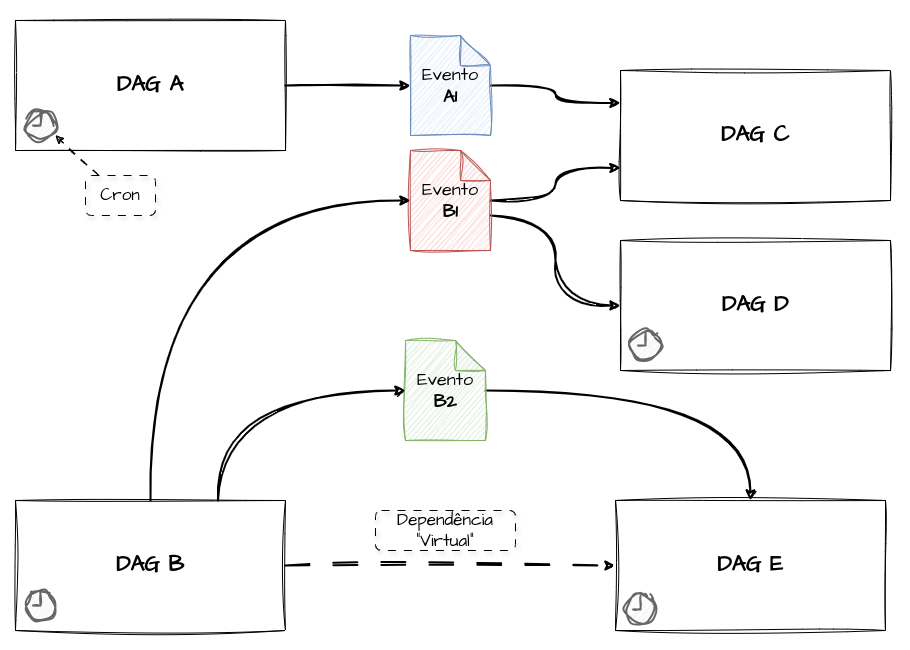

# data-aware-scheduling

Testes com schedule orientado a eventos utilizando o airflow

## Datasets

- [Referência](https://airflow.apache.org/docs/apache-airflow/stable/authoring-and-scheduling/datasets.html)

A Imagem abaixo ilustra um esquemático de dags criado para ilustrar o funcionamento dos Datasets.



```shell
# Para iniciar o airflow local
make start
```
